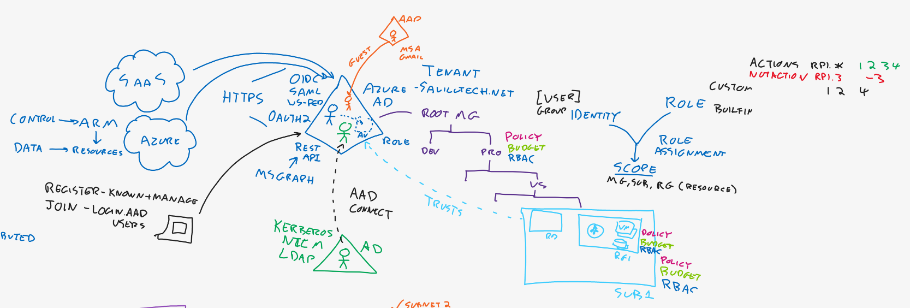
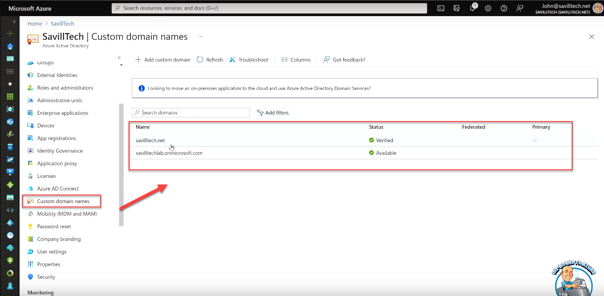

# JAMAA - Az 104 microsoft azure administrator associate certification - john savills

## Questions

### Part I - Introduction

#### Chapter 1 - Identity and Azure AD

Q:: What is Azure Active Directory (Azure AD) and how does it relate to cloud services?  
A:: Azure Active Directory (Azure AD) serves as the identity provider for cloud services.



Q:: Which cloud protocols does Azure AD support?  
A:: Azure AD supports cloud protocols like OpenID Connect, SAML, WS-Fed, and OAuth 2 (authorization).


Q:: How do these cloud protocols typically function over the internet?  
A:: These cloud protocols typically function over the internet and operate over HTTPS.


Q:: How can applications programmatically interact with Azure AD?  
A:: Applications can programmatically interact with Azure AD using its RESTful APIs.


Q:: What is Microsoft Graph, and how is it related to Azure AD?  
A:: Microsoft Graph is a way to programmatically interact with Azure AD.


Q:: What are some examples of services that trust Azure AD as their identity provider?  
A:: Some examples of services that trust Azure AD as their identity provider include Software as a Service (SaaS) applications, Azure and Office 365.


#### Chapter 2 - AD on-premises

Q:: How does Azure AD differ from the on-premises Active Directory?  
A:: Azure AD is different from the on-premises Active Directory. On-premises Active Directory runs on your network and uses different communication protocols like Kerberos, NTLM, and LDAP, whereas Azure AD is designed for the cloud and uses different protocols suitable for the internet.


Q:: Why is it crucial to understand the difference between Azure AD and on-premises Active Directory?  
A:: Understanding the difference is crucial because they serve different purposes and have distinct protocols and capabilities, and using the right one is essential for effective cloud identity management.


Q:: What are some of the communication protocols used by on-premises Active Directory?  
A:: On-premises Active Directory uses protocols like Kerberos, NTLM, and LDAP.


Q:: What unique capabilities does Active Directory on-premises have?  
A:: On-premises Active Directory has unique capabilities such as an organizational unit structure for organizing components and domain controllers.


Q:: What is Azure AD Connect, and how is it used?  
A:: Azure AD Connect is a tool used to replicate objects from on-premises Active Directory to Azure AD, ensuring consistency in identity management.


Q:: Is it possible to create objects in Azure AD and replicate them back to on-premises Active Directory? Why or why not?  
A:: No, it is not possible to create objects in Azure AD and replicate them back to on-premises Active Directory. Replication typically flows from on-premises AD to Azure AD.


Q:: What do companies receive when they use Azure AD?  
A:: Companies receive a "tenant," which is an instance of Azure AD.


Q:: What is meant by a "tenant" in the context of Azure AD?  
A:: In the context of Azure AD, a "tenant" refers to an instance of Azure AD associated with a company.


Q:: Can you add custom domains to Azure AD? Why might this be necessary?  
A:: Yes, custom domains can be added to Azure AD. This might be necessary to align Azure AD with a company's branding or naming conventions. e.g. "savilltech.net"



---

DECK INFO

TARGET DECK: Azure::AZ-104::JAMAA - Az 104 microsoft azure administrator associate certification - john savills

FILE TAGS: #Microsoft #Azure #AZ-104 #Administrator

Reference:

Related:

```dataview
LIST
where file.name = this.file.name
```

