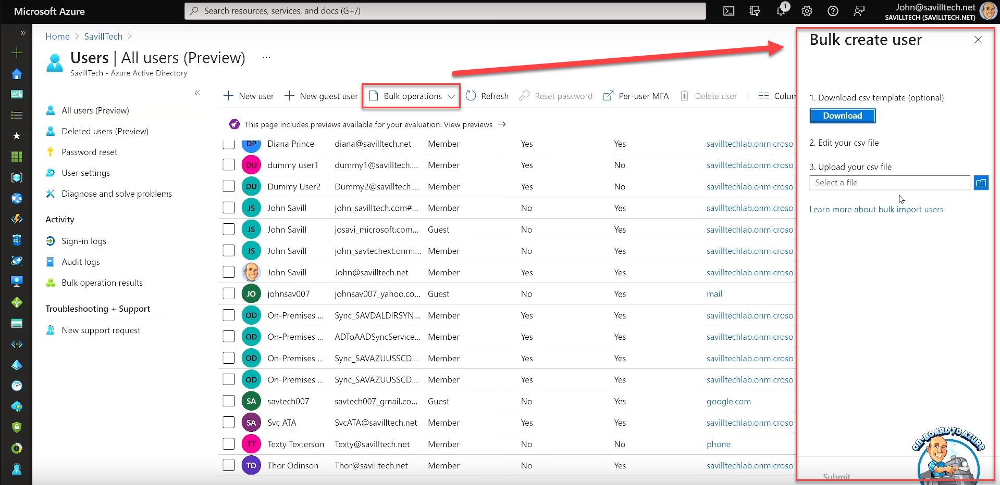

# JAMAA - Az 104 microsoft azure administrator associate certification - john savills

## Questions

### Part I - Introduction

#### Chapter 1 - Identity and Azure AD

Q:: What is Azure Active Directory (Azure AD) and how does it relate to cloud services?  
A:: Azure Active Directory (Azure AD) serves as the identity provider for cloud services.


Q:: Which cloud protocols does Azure AD support?  
A:: Azure AD supports cloud protocols like OpenID Connect, SAML, WS-Fed, and OAuth 2 (authorization).


Q:: How do these cloud protocols typically function over the internet?  
A:: These cloud protocols typically function over the internet and operate over HTTPS.


Q:: How can applications programmatically interact with Azure AD?  
A:: Applications can programmatically interact with Azure AD using its RESTful APIs.


Q:: What is Microsoft Graph, and how is it related to Azure AD?  
A:: Microsoft Graph is a way to programmatically interact with Azure AD.


Q:: What are some examples of services that trust Azure AD as their identity provider?  
A:: Some examples of services that trust Azure AD as their identity provider include Software as a Service (SaaS) applications, Azure and Office 365.


#### Chapter 2 - AD on-premises

Q:: How does Azure AD differ from the on-premises Active Directory?  
A:: Azure AD is different from the on-premises Active Directory. On-premises Active Directory runs on your network and uses different communication protocols like Kerberos, NTLM, and LDAP, whereas Azure AD is designed for the cloud and uses different protocols suitable for the internet.


Q:: Why is it crucial to understand the difference between Azure AD and on-premises Active Directory?  
A:: Understanding the difference is crucial because they serve different purposes and have distinct protocols and capabilities, and using the right one is essential for effective cloud identity management.


Q:: What are some of the communication protocols used by on-premises Active Directory?  
A:: On-premises Active Directory uses protocols like Kerberos, NTLM, and LDAP.


Q:: What unique capabilities does Active Directory on-premises have?  
A:: On-premises Active Directory has unique capabilities such as an organizational unit structure for organizing components and domain controllers.


Q:: What is Azure AD Connect, and how is it used?  
A:: Azure AD Connect is a tool used to replicate objects from on-premises Active Directory to Azure AD, ensuring consistency in identity management.


Q:: Is it possible to create objects in Azure AD and replicate them back to on-premises Active Directory? Why or why not?  
A:: No, it is not possible to create objects in Azure AD and replicate them back to on-premises Active Directory. Replication typically flows from on-premises AD to Azure AD.


Q:: What do companies receive when they use Azure AD?  
A:: Companies receive a "tenant," which is an instance of Azure AD.


Q:: What is meant by a "tenant" in the context of Azure AD?  
A:: In the context of Azure AD, a "tenant" refers to an instance of Azure AD associated with a company.


Q:: Can you add custom domains to Azure AD? Why might this be necessary?  
A:: Yes, custom domains can be added to Azure AD. This might be necessary to align Azure AD with a company's branding or naming conventions. e.g. "savilltech.net"


#### Chapter 3 - AAD Connect and customization

Q:: Where does Azure AD exist in relation to Azure subscriptions?  
A:: Azure AD exists outside of Azure subscriptions.


Q:: Do Azure subscriptions contain Azure AD instances? Why or why not?  
A:: No, Azure subscriptions do not contain Azure AD instances. Instead, subscriptions trust a specific instance of Azure AD. This relationship is crucial for managing resources and identities in Azure


Q:: Can you change the directory that a subscription trusts?  
A:: Yes, you can change the directory that a subscription trusts.


#### Chapter 4 - Users

Q:: How can users be added to Azure AD?  
A:: Users can be added to Azure AD through various methods, including directory synchronization, creating cloud accounts, and adding guest accounts.


Q:: What is the benefit of using Azure AD Connect to synchronize accounts from an existing Active Directory?  
A:: Using Azure AD Connect to synchronize accounts provides a seamless user experience and ensures that existing Active Directory accounts can be used in Azure AD.


Q:: Can you explain the concept of guest accounts in Azure AD?  
A:: Guest accounts in Azure AD are accounts that can be added from external sources, such as different Azure AD tenants, Microsoft accounts, or Gmail accounts.


Q:: How does authentication work for guest accounts in Azure AD?  
A:: Authentication for guest accounts in Azure AD is done by the originating identity provider associated with the guest account.


Q:: What aspects of guest accounts can still be controlled by the Azure AD tenant?  
A:: While authentication is managed by the originating identity provider, the Azure AD tenant can control aspects like authorization check requirements for guest accounts.


Q:: Which types of services can trust an Azure AD tenant for permissions?  
A:: Various types of services can trust an Azure AD tenant for permissions, including Azure subscriptions, Microsoft 365 services like SharePoint, and third-party apps configured to trust the Azure AD tenant.


Q:: What is the significance of having different types of identities in Azure AD?  
A:: Having different types of identities in Azure AD allows for flexibility in managing user accounts, accommodating various authentication sources, and granting permissions to different types of services.


Q:: What are bulk operations in Azure, and how can they be useful?  
A:: Bulk operations in Azure refer to performing actions on multiple items simultaneously. They are useful for efficiently managing large-scale tasks. e.g. creating multiples user using a csv template.



Q:: How does PowerShell play a role in bulk items creation in Azure?  
A:: PowerShell can be used to perform bulk items creation in Azure through scripting, enabling automation and customization of the process.


#### Chapter 5 - Groups

Q:: Why is it generally better to add users to groups when granting permissions to resources?  
A:: Adding users to groups simplifies permission management, centralizes access control, and makes it easier to manage permissions for multiple users at once.


Q:: What is the primary difference between "assigned" and "dynamic" membership in Azure groups?  
A:: The primary difference is that "assigned" membership involves manually adding members to a group, while "dynamic" membership is determined by predefined rules.


Q:: Are there any special considerations for assigning Azure AD roles to groups? If so, what are they?  
A:: Yes, there are special considerations for assigning Azure AD roles to groups. Normally, you cannot assign Azure AD roles to groups, but you can enable this option when creating a new group. Once enabled, Azure AD roles can be assigned to that group, but it makes the group assignment non-dynamic (not based on rules)..


#### Chapter 6 - Devices

Q:: How can devices be associated with Azure AD?  
A:: Devices can be associated with Azure AD through device registration or device joining (Register Plus+).


Q:: What is the purpose of making devices known to Azure AD?  
A:: Making devices known to Azure AD enables the checking of device health (jailbroken, rooting, etc.) and the enforcement of Conditional Access rules before granting users access to resources.


Q:: What is the primary function of device registration in Azure AD?  
A:: Device registration in Azure AD makes the device known to Azure AD, allowing for certain management capabilities and potential integration with tools like Intune.


Q:: What additional capabilities are provided when a device is joined (Register Plus+) to Azure AD, compared to registration alone?  
A:: When a device is joined to Azure AD, it not only becomes known but also allows direct authentication with users in Azure Active Directory, taking device integration to the next level.


Q:: In what scenarios might device registration be preferred?  
A:: Device registration might be preferred for personal devices where certain security checks and management are still required.


Q:: In what scenarios might device joining be preferred?  
A:: Device joining might be preferred for corporate devices that need to directly authenticate with users in Azure Active Directory.


---

DECK INFO

TARGET DECK: Azure::AZ-104::JAMAA - Az 104 microsoft azure administrator associate certification - john savills

FILE TAGS: #Microsoft #Azure #AZ-104 #Administrator

Reference:

Related:

```dataview
LIST
where file.name = this.file.name
```

